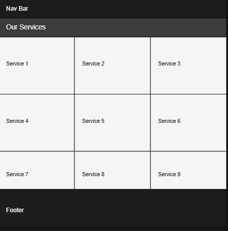

# Beard & Blade 


A premium barber services web application offering online booking, user reviews, and account management.


# [Live Site](https://beard-blade-b70a56b4f23e.herokuapp.com/)
## Table of Contents

- [Overview](#overview)
- [Languages & Technologies](#languages--technologies)
- [Installation & Setup](#installation--setup)
- [Features](#features)
- [Color Scheme](#color-scheme)
- [Database Schema](#database-schema)
- [Wireframes](#wireframes)
- [User Story & Admin Story](#user-story--admin-story)
- [Manual Testing](#manual-testing)
- [References](#references)

## Overview

Beard & Blade is a Django-based application that provides a premium barbering experience. Users can browse available services, book appointments, and leave reviews, while administrators can manage bookings, services, and reviews.

## Languages & Technologies

- **Backend:** Python, Django
- **Frontend:** HTML, CSS, Bootstrap, JavaScript
- **Database:** PostgreSQL (configured via dj_database_url)
- **Others:** django-crontab, django-allauth, django-star-ratings, autopep, django-debug-toolbar, whitenoise, mailjet (for email notifications)

## Installation & Setup

Follow these steps to set up and run the Beard & Blade project on your local machine:

### Prerequisites

- **Python 3.8+**: Ensure you have Python installed. You can download it from [python.org](https://www.python.org/downloads/).
- **Virtual Environment**: It is recommended to use a virtual environment to isolate your project dependencies.
- **Database**: The project uses PostgreSQL in production (configured via dj_database_url). For local development, you can either use PostgreSQL or SQLite (if you modify the settings accordingly).
- **Git**: Ensure Git is installed to clone the repository.

### Clone the Repository

1. Open your terminal or command prompt.
2. Clone the repository:

   ```bash
   git clone https://github.com/collinsevan/beard-blade
   cd beard-blade


## Features

### User Management
- **Registration & Authentication:**  
  Users can sign up, log in, and log out. The system validates inputs, ensuring unique usernames and matching passwords.
- **Password Management:**  
  Integrated password reset (via email) and password change functionalities for secure account handling.

### Service & Booking System
- **Service Catalog:**  
  Display a list of available services, each with a name, price, and duration. Services are defined in the `Service` model.
- **Booking Process:**  
  Users can book a service by selecting a date and a start time. The booking process:
  - Validates that the selected date is not in the past.
  - Determines the required number of contiguous 15-minute timeslots based on the service duration.
  - Checks for availability of timeslots before creating a booking.
  - Allows users to edit or cancel their bookings via their profile.
- **Timeslot Management:**  
  Timeslots are generated in 15-minute intervals using the `TimeSlot` model. The project includes a management command (`timeslots.py`) that:
  - Generates future timeslots based on the shop's opening hours defined in the `OpeningHours` model.
  - Ensures each timeslot is set as 'available' until booked.
- **Automatic Booking Updates:**  
  A management command (`completed.py`) automatically marks confirmed bookings as completed when their end time has passed.

### Reviews & Ratings
- **Review Submission:**  
  After a completed booking, users can submit reviews with a star rating and an optional comment. Each booking can have one review.
- **Star Rating Integration:**  
  Reviews use a star rating widget, leveraging the `star_ratings` package for visual feedback.
- **Review Management:**  
  Users can edit or delete their reviews from the profile page.

### Admin Features
- **Admin Dashboard:**  
  Administrators have access to a dedicated admin panel where they can manage:
  - Services, timeslots, and opening hours.
  - Bookings, including confirming, declining, or cancelling them via custom admin actions.
  - Reviews submitted by users.
- **Custom Admin Widgets:**  
  Custom star rating widgets allow for a better review management experience in the admin interface.

### Additional Functionalities
- **Cron Jobs & Automated Tasks:**  
  - A cron job (configured in `settings.py`) runs the timeslot generator command daily to prepare future appointment slots.
  - Another cron job marks bookings as completed once the booking's end time has passed.
- **Email Notifications:**  
  Integrated email backend (using Mailjet) handles password reset emails and other notifications.
- **Custom Error Handling:**  
  The project includes custom error pages (400, 403, 404, 500, etc.) for a better user experience in case of errors.


## Color Scheme

Below is the project's color palette, as defined in the CSS and used across various templates:


### Color Usage

- **Primary Dark (`#1c1c1c`):**
  - **Usage:** Set as the overall body background in `style.css` to create a modern, dark theme.
  - **Templates:** Applied globally via the `<body>` element in `base.html`.

- **Rich Brown (`#5d2506`):**
  - **Usage:** Used for primary action buttons (`.btn-brown`), such as "Sign Up" in `register.html` and "Log In" in `login.html`.
  - **Templates:** Consistent call-to-action elements in multiple templates.

- **Gold Accent (`#af8c16`):**
  - **Usage:** Defined as a variable for potential highlights or secondary accents.
  - **Templates:** Available for future use where additional emphasis is needed.

- **Professional White (`#f5f5f5`):**
  - **Usage:** Applied to text elements like headings and paragraphs to ensure high contrast on dark backgrounds.
  - **Templates:** Widely used in `base.html`, `about.html`, and other content sections.

- **Light Background (`#f4f4f4`):**
  - **Usage:** Provides a lighter contrast background when needed, although it appears less frequently.
  - **Templates:** Can be used for sections where a softer background is desired.

- **Dark Gray (`rgb(60, 60, 60)`):**
  - **Usage:** Used as the background color for forms, cards, and modals (e.g., in `booking.html`, `register.html`, `login.html`, and `review_form.html`).
  - **Templates:** Helps the content stand out against the overall dark theme.

- **Grey Buttons (`#6c757d`):**
  - **Usage:** Applied to secondary buttons, such as those for cancel actions and password changes.
  - **Templates:** Seen in the profile page and various modals for consistent secondary action styling.

## Database Schema

Below is the ER diagram representing the database schema for Beard & Blade:


### Models and Relationships

- **User**
  - **Fields:**
    - `id`: Primary Key
    - `username`: User's unique username
    - `email`: User's email address

- **Service**
  - **Fields:**
    - `id`: Primary Key
    - `name`: Service name (unique)
    - `duration`: Duration of the service (stored as a duration/timedelta)
    - `price`: Service price (decimal)

- **TimeSlot**
  - **Fields:**
    - `id`: Primary Key
    - `date`: Date of the timeslot
    - `start_time`: Start time of the timeslot
    - `end_time`: End time of the timeslot
    - `status`: Status of the slot (choices: "available", "pending", "booked", "expired")
  - **Constraints:**  
    Unique together on (`date`, `start_time`, `end_time`)

- **OpeningHours**
  - **Fields:**
    - `id`: Primary Key
    - `day_of_week`: Integer representing the day (0=Monday, ..., 6=Sunday; unique)
    - `open_time`: Opening time for the day
    - `close_time`: Closing time for the day

- **Booking**
  - **Fields:**
    - `id`: Primary Key
    - `status`: Booking status (choices: "pending", "confirmed", "completed", "cancelled")
    - `created_at`: Timestamp when the booking was created
    - `updated_at`: Timestamp when the booking was last updated
    - `user`: Foreign Key to **User** (the user who made the booking)
    - `service`: Foreign Key to **Service** (the booked service)
  - **Relationships:**
    - **Many-to-Many:** Connects with **TimeSlot** via a join table (each booking reserves multiple 15-minute timeslots)

- **Review**
  - **Fields:**
    - `id`: Primary Key
    - `rating`: Rating value (1 to 5)
    - `comment`: Optional text field for additional feedback
    - `created_at`: Timestamp when the review was created
    - `updated_at`: Timestamp when the review was updated
    - `booking`: One-to-One relation with **Booking** (each booking can have one review)
    - `user`: Foreign Key to **User** (the user who wrote the review)

## Wireframes

Below are the wireframes for each major page of the Beard & Blade application. Each wireframe shows the general layout, navigation, and key elements of the respective page.

### Home Page Wireframe


- **Purpose:** Introduces users to Beard & Blade with a hero section and prominent call-to-action button.  
- **Layout Highlights:**  
  - Navigation bar at the top.  
  - Hero section with a background image, branding text, and "Book Now" button.  
  - Footer connected at the bottom.

---

### Services Page Wireframe


- **Purpose:** Displays a grid of available services (name, duration, price) with a "Book Now" option.  
- **Layout Highlights:**  
  - Navigation bar at the top.  
  - Service cards arranged in rows, each showing essential information.  
  - Footer connected at the bottom.

---

### About Page Wireframe


- **Purpose:** Provides background information on the establishment and head barber.  
- **Layout Highlights:**  
  - Navigation bar at the top.  
  - Two sections showcasing images and descriptive text (one for the establishment, one for the barber).  
  - Footer at the bottom for consistency.

---

### Login Page Wireframe


- **Purpose:** Allows returning users to log into their accounts securely.  
- **Layout Highlights:**  
  - Navigation bar at the top.  
  - Simple form for entering username and password.  
  - "Log In" button styled in line with the site’s color scheme.  
  - Footer connected at the bottom.

---

### Registration Page Wireframe


- **Purpose:** Lets new users create an account with username, email, and password fields.  
- **Layout Highlights:**  
  - Navigation bar at the top.  
  - Form fields for username, email, password, and password confirmation.  
  - "Sign Up" button in the site’s signature color.  
  - Footer at the bottom to maintain site consistency.
